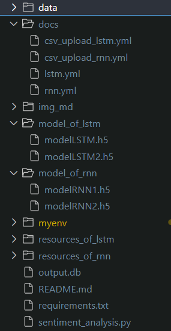

## About Sentiment Analysis
---
Sentiment Analysis is an API made using Flasgger. It predicts sentiment of inputted data.

It has four endpoints.
- **inputRNN**: user can input the text manually here, the system will predict using RNN
- **inputLSTM**: user can input the text manually here, the system will predict using LSTM
- **uploadCSV_RNN**: user can upload CSV file here, the system will predict using RNN
- **uploadCSV_LSTM**: user can upload CSV file here, the system will predict using LSTM

## <b>How to Run Sentiment Analysis</b>
---
1. Clone this repository
2. Install module needed by running this code
> pip install -r requirements.txt
3. Go to path below
> (venv_name)\Lib\site-packages\keras\src\saving\legacy\saved_model\load_context.py
4. Rewrite "register_load_context_function" to "register_call_context_function" (line 68)
5. Run the app
> python sentiment_analysis.py
6. Open browser and go to link below
> http://127.0.0.1:5000/docs/

Successful deployment will result below.
 

## 
<b>Directory and File List</b>

---

## 
<b>Analysis Report</b>

---
