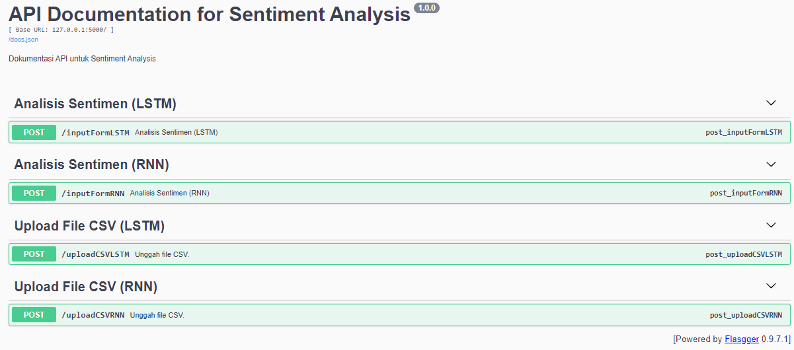

## About Data Cleanser
---
Data Cleanser is an API made using Flasgger. It aimed to cleanse data (specifically X or Twitter data), such as removing punctuations and removing whitespace.

It has two endpoints.
- **inputForm**: user can input the text manually here
- **uploadCSV**: user can upload CSV file here

## <b>How to Run Data Cleanser</b>
---
1. Clone this repository
2. Install module needed by running this code
> pip install -r requirements. txt
3. Run the app
> python data-cleanser.py
4. Open browser and go to link below
> http://127.0.0.1:5000/docs/

Successful deployment will result below.
 

## 
<b>Analysis Report</b>

---